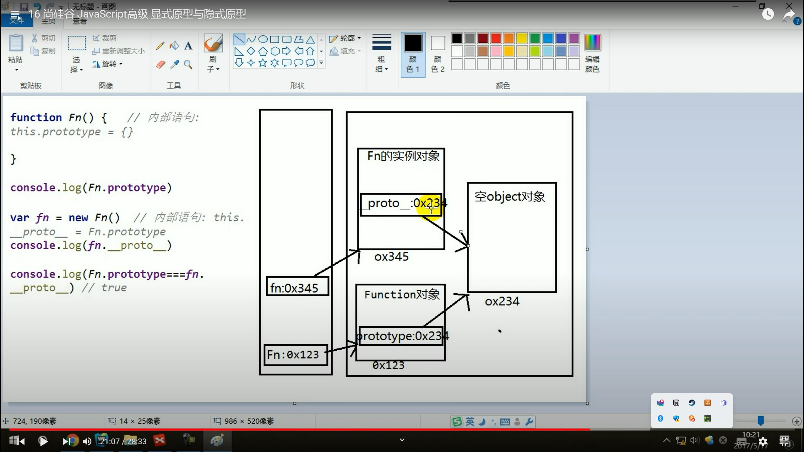
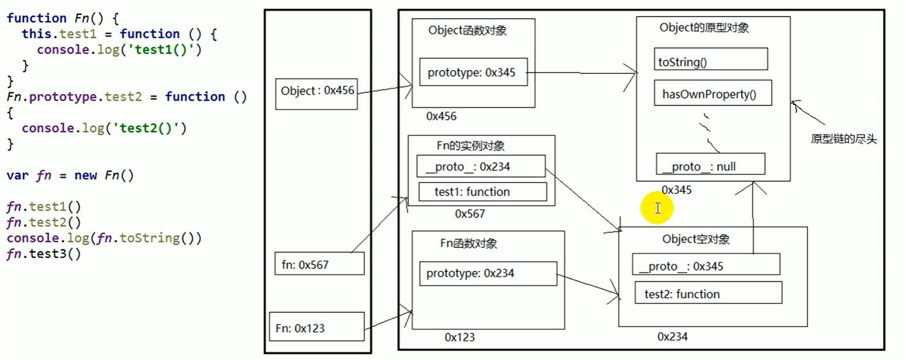
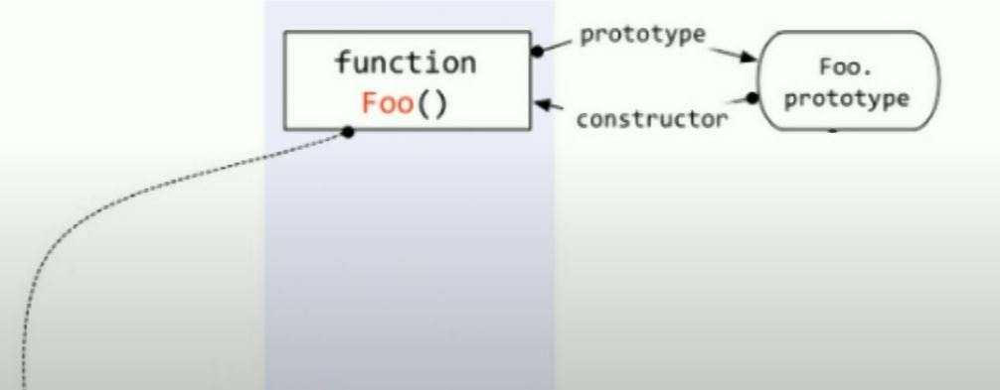
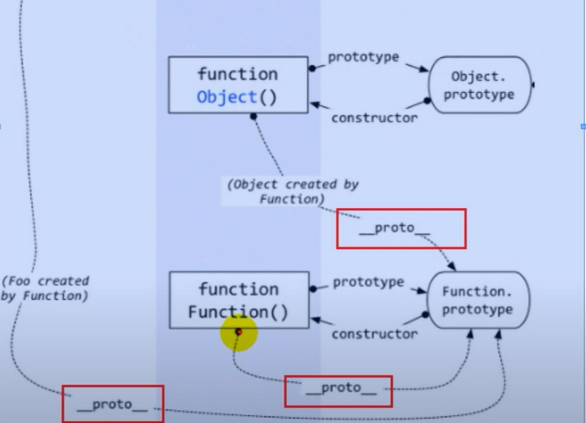

# 尚硅谷 js 高级技术
> lecture 02
## 1.基础回顾
### 1.1 数据类型
数据看什么  
1. 数据类型分类  
    - 基本（值）类型：String, Number, Boolean, Undefined, Null  
    - 对象（引用）类型:  
        - Object 任意对象  
        - Function 一种特别的对象（可以执行）  
        - Array 一种特比的对象（属性名为数值下标，内部数据是有序的）
2. 判断数据类型
    - typeof:
        - 可以判断 undefined/数值/字符串/布尔值/function;
        - 不能判断:null与object，object与array
        - typeof返回数据类型的字符串表达
    - instanceof: 判断对象的具体类型，比如是一个函数含是一个数组（how about String()???）
    - === 可以判断 undefined 和 null, 因为这两个数据类型只有一个值
```javascript
//基本数据类型
// typeof返回数据类型的字符串表达
var a;
console.log(a, typeof a); //undefined "undefined"
console.log(typeof a==="undefined", a===undefined); //true true

a = 3;
console.log(typeof a === "number"/*小写首字母*/); // 不能 a === number
a = "atguigu";
console.log(typeof a === "string"/*小写首字母*/); 
a = true;
console.log(typeof a === "boolean"/*小写首字母*/); 
a = null;
console.log(typeof a); // "object" 说明无法使用typeof判断 null, 可以用全等

//2.对象
var b1 = {
    b2:[1, "abc", console.log],
    b3:function() {
        console.log('b3');
    }
}

console.log(b1 instanceof Object); // true, a 是不是 B 类型的实例(对象)，B应该是一个构造函数
console.log(b1 instanceof Array); // false
console.log(b1.b2 instanceof Array, b1.b2 instanceof Object); // true true
console.log(b1.b3 instanceof Function, b1.b3 instanceof Object); // true true

//判断函数还有一种方式
console.log(typeof b1.b3==='function') // true

//基本知识，重要

```
> lecture 3 尚硅谷 JavaScript高级 相关问题
```javascript
// 区分
// 实例：实例对象
// 类型：类型对象
```
> 函数只有在new的时候才是构造函数，大写只是为了易读性。

常见面试题：
>1. undefined 和 null 有什么区别:
>       - undefined 代表定义了未赋值
>       - null代表未定义，值为null
>2. 何时给变量赋值为null  
>       - 定义一个对象，并初始赋值为 null, 表明这是一个对象
>       - 结束前，让对象成为垃圾对象，从而被垃圾回收器回收
>```javascript
>var obj = null; // 初始赋值为null，表明将要赋值为对象，包括数组和function
>var b = null; // 初始赋值为null，表明将要赋值为对象，包括数组和function
>
>// null 是为 object 准备的
>// 还有另外一个用途：obj = null； 进行垃圾回收
>```
> 3. 严格区别变量类型与数据类型？
>   - 数据的类型
>       - 基本类型
>       - 对象类型
>   - 变量的类型
>       - 基本类型：保存的是基本类型数据
>       - 引用类型：保存的是对象类型数据的地址值

> javascript 是一个弱类型语言，变量本身是没有类型的，判断类型判断的是值的类型
> Lecture 04 数据 变量 内存
### 1.2 数据，变量，内存
内存，数据，变量：

- 什么是数据
    - 储存在内存中代表特定信息的'东东'
    - 数据的特点：可传递，可运算
    - 一切皆数据？一切皆对象？
    - 内存中所有操作的目标：数据
        - 算术运算，逻辑运算，赋值，运行函数如 fun()
    - 形参的本质也是一个局部变量，实参的本质是变量值

- 什么是内存  
    - 内存条通电以后产生的可存储数据的空间，所以是临时的
    - 内存的产生和消失：内存条（电路板）==>通电==>产生内存空间==>存储数据==>处理数据==>内存空间和数据都消失；
    - 一块小内存的2个数据
        - 内存存储的数据
        - 地址值
    - 内存分类
        - 栈：全局变量和局部变量
        - 堆：对象
- 什么是变量
    - 可变化的量，由变量名和变量值组成
    - 每个变量都对应着一个小内存，变量名用来查找对应的内存，变量值就是内存中保存的数据
    - 读写变量的情况。写变量的两种情况：1.变量赋值var a = 3; 2.传参是写函数的局部变量；读变量的情况有很多;

- 内存，数据，变量三者之间的关系 
    - 内存是用来存储数据的临时空间
    - 变量是内存的标识，
> lecture 5 尚硅谷 js 高级

练习
> 函数一执行完，函数内部的局部变量就会被释放，变成垃圾对象。

> lecture 6 尚硅谷 js 高级

练习

引擎如何管理内存
1. 内存声明周期
    - 分配小内存空前，得到他的使用权
    - 储存数据，可以反复进行操作
    - 释放小内存空间
2. 释放内存
    - 局部变量，函数执行完自动释放
    - 对象：成为垃圾对象===>垃圾回收器回收
    - 全局变量，当次执行不会回收
> lecture 7 尚硅谷 js 高级
### 1.3 对象
1. 什么是对象
    - 多个数据的封装体
    - 用来保存多个数据的容器
    - 一个对象代表现实世界中的一个事物
2. 为什么要找对象：统一管理
3. 对象的组成
    - 属性（状态数据）：属性名（字符串）和属性值组成的，虽然语法做了修改，但属性名实际上是字符串
    - 方法（行为数据）：一种特别的属性
4. 如何访问对象内部数据
    - .属性名，编码简单，但有时不能用，比如
        - 属性名包含特殊字符不能用此方法获取属性名
        - 属性名不想写死，要放到变量名里，然后使用obj获取变量里的属性名字符串时
    - ["属性名"]，编码麻烦，能通用
> lecture 8 尚硅谷 js 高级
### 1.4 函数
函数比较复杂，因为即使对象，又可以执行
1. 什么是函数
    - 实现特定功能的n条语句的封装提
    - 只有函数是可以执行的，其他类型的数据不能执行
2. 为什么要用函数
    - 提高代码复用
    - 便于阅读交流
    - 函数体现的是封装的思想
3. 如何定义函数
    - 函数声明
    - 表达式
    - 他们的区别：变量提升
4. 如何调用（执行）函数
    - 使用 () 直接调用
    - 通过对象调用 obj.text()
    - new 调用
    - text.call/apply(obj):临时的让text成为obj的方法进行调用
    ```javascript
        var obj = {};
        function text2(){
            this.xxx = 'atguigu'
        }
        test2.call(obj) //相当于 obj.text2() 但不能直接这么调用
        // 可以让一个函数成为指定任何对象的方法进行调用，js独有的方法
        console.log(obj.xxx)
    ```
#### 1.5 回调函数
1. 什么函数才是回调函数
    - 你定义的
    - 你没有调，但最终他执行了，比如
        - dom 事件回调函数, 包括任何事件，如 onclick,this 是发生时间的dom元素 比如button(btn.onclick???)
        - 定时器回调函数,this 是 window。回调函数里的函数也是window调用的，因为函数没法调用函数，只有对象（包括构造函数的实例）可以调用函数（本质上）。
        - ajax请求回调函数（后面讲）
        - 生命周期回调函数（后面讲）

> 两种交互：  
>- 与用户的交互，页面与人的交互
>- 与后台的交互

> 定时器  
>   - 超时定时器
>   - 循环定时器
2. 常见的回调函数

> lecture 10 IIFE

立即执行（或调用）函数表达式
- 函数要么（取个名字）存起来，通过变量或函数表达式
- 要么定义了立即执行
    - 加一个括号，函数本身也通过（）括起来表示一个整体
        ```js
            (function(){ //匿名函数子调用 等同于IIFE
                var a = 3；
                console.log(a+3); //在函数内是局部空间，好处是：1.隐藏实现 2.不产生全局变量a，不污染外部命名空间，
            })()
        ```
    - 是否通过回调函数传参来执行？？？

>ltecture 11
### 1.6 This
1. this是什么
    - 任何函数本质上都是通过某个对象（狭义的，注意不是函数来调用的）来调用的，我么也可以指定，但只能指定对象。
    - 我们指定可以是显示的指定，也可以是隐式的指定
    - 如果完全没有指定，有可能是window或者其他,如dom元素
    - 所有函数内部都有一个变量this
    - 他的值是调用函数的当前对象
2. 如何确定this的值
    - fun():window
    - p.fun():p
    - new fun():新创建的实例对象（即使不定义一个变量去接收这个对象，这个对象也是存在的）
    - p.call(obj，参数1): obj
```js 
//example
function fun2(){
 function fun1() {
     console.log(this);
 }
    fun1();
}

fun2();
//-> Window

//原因：fun1 函数是在 fun2 函数内部直接调用的，而不是作为对象的方法或通过构造函数调用。因此，fun1 函数内部的 this 将指向全局对象（在浏览器环境中是 window 对象）。

//总结：只能对象或构造函数的实例能调用函数，并成为this，函数不能调用其他函数，也不能是this
```
> lecture 12

js 可以不用分号

但是不用分号时，需要注意几点：
- 小括号开头的前一条语句，需要加分号，或者在前一条语句前
比如，
    ```js
    var a = 3; //函数自调用
    (function () {
        
    })
    ```
    所以在每一个js模块的最前面加分号，以防止前一个模块没加分号

- 中括号开头的前一条语句
    ```js
    var b = 4
    [1,2].forEach(function(){

    })
    ```
> lecture 13 webstorm设置

> lecture 14 js高级 复习 (有空值得在看一看)

了解结构： 变量  =(赋)  值

当修改变量内的对象时，可能修改了此对象，也坑修改了地址值从而换成了新的对象，所以在实践中要注意区分 

## 函数高级

### 2.1 原型与原型链

#### 2.2.1 原型的概念
1. 函数的 `prototype` 显示原型（属性）和 `[[proto]]` 隐式原型（属性）
    - 每个函数都有`prototype`属性，他默认指向一个Object空对象(即称为：原型对象)，所谓空对象是指没有我们自己手动设置的的属性。
    - 每个实例对象都有`[[proto]]`，称为隐式原型
    - 对象的隐式原型的值为其对应的构造函数的显式原型的值
    - 原型对象中有一个属性constructor，他指向函数对象

    > 构造函数Fn在创建实例对象fn时，写了一条语句:
    > ```js
    > this.__proto__ = Fn.prototype;
    > this.prototype = {}
    > ```
    
    > Examples:
    ```js
    // 一些 Examples
    console.log(Date.prototype.constructor === Date); //true
    console.log(fun.prototype.constructor === fun); //true
    console.log(Object.prototype.constructor === Object); //true

    console.log(Object.getPrototypeOf(Object.prototype)); // null
    console.log(Object.getPrototypeOf(Object)); // ƒ anonymous()
    console.log(Object.getPrototypeOf(Object) === Function.prototype); // true
    console.log(Object.getPrototypeOf(Function) === Function.prototype); //true

    function Fn(){};
    let fn = new Fn();
    console.log(Object.getPrototypeOf(fn) === Fn.prototype);
    console.log(Object.getPrototypeOf(obj) === Object.prototype ); //true
    console.log(Object.getPrototypeOf(Object) === Object.prototype ); //false
    ```
    > 构造函数和他的原型对象是相互引用
    
    
    > 总结：  
    函数的 `prototype` 属性：在定义函数时自动添加，默认值是一个空对象  
    函数的 `[[proto]]` 属性：创建对象时自动添加的，默认值为构造函数的 `prototype` 属性值  
    程序员能直接操作显式原型，但不能直接操作隐式原型（ES6之前）
2. 给原型对象添加属性（一般都是方法）
    - 作用：函数的左右实例对象自动拥有圆形中的属性（方法）
3. 构造函数和Class里的构造器是一个作用，本质上构造函数和Class中的构造器都用于对象的初始化，它们在JavaScript中实现相同的目标。Class语法糖是在ES6中引入的，它提供了一种更清晰、更具面向对象特性的写法，但在底层实现上，它仍然依赖于构造函数的概念。

#### 2.2.2 显示原型（属性）与隐式原型（属性）  
- 每个实例对象都有一个 [[proto]] 
- 对象的隐式原型的值为其对应构造函数的显示原型的值  

写Function中的显示原型prototype，读fn的隐式原型[[proto]]，也就是__proto__

> Lecture 17 尚硅谷 JavaScript高级 原型链

原型链  

1. 原型链（图解）
    - 访问一个对象的属性时，
        - 现在自身属性中查找，找到返回
        - 如果没有，再沿着__proto__这条链向上查找，找到返回
        - 如果最终每找到，返回undefined
    - 别名：隐式原型链
    - 作用：查找对象的属性(方法)

在JavaScript中，Object.prototype 是所有对象的原型对象，而 Object.[[Proto]]（通常通过 __proto__ 访问）是对象内部的一个属性，指向该对象的原型。这两者之间确实指向同一个对象，但是由于访问方式的不同，可能出现 Object.[[Proto]] 不等于 Object.prototype 的情况。

下面是一个简单的例子，演示了这种情况：

```js
let obj = {};

console.log(obj.__proto__ === Object.prototype); // true
console.log(obj.__proto__ === Object["prototype"]); // true

console.log(Object.prototype === Object["prototype"]); // true
```
在这个例子中，obj 是一个空对象。通过 __proto__ 或者 Object["prototype"] 都能访问到它的原型，而且它们指向同一个对象 `Object.prototype`。

不过，需要注意的是，__proto__ 是非标准的属性，虽然在很多现代浏览器中得到了支持，但不建议在生产代码中使用。更推荐使用 `Object.getPrototypeOf()` 方法来获取对象的原型。

```js
let obj = {};
let prototype = Object.getPrototypeOf(obj);

console.log(prototype === Object.prototype); // true
```
总的来说，虽然 Object.[[Proto]] 和 Object.prototype 指向同一个对象，但是它们是通过不同的路径访问的，其中 Object.[[Proto]] 是对象内部的属性，而 Object.prototype 是所有对象的原型对象。

> 上图有一个小问题，fn和Fn都应该包含两种原型？因为构造函数也是Function的实例？所有函数都有两个属性，一个显式原型，一个隐式原型？

构造函数/原型/实体对象的关系（图解）


> 上面这个图很重要
> 所有函数的`_proto_`都是一样的，因为都是来自于`new Function()`
> `Object()` 也是函数实例，所以`_proto_`也是来自于`new Function()`


> 需要搞明白的核心概念：实例 和 构造函数，对象 和 构造函数 和 实例，两种原型 之间的所有关系？！去console里试一试？！


#### 2.2.3 原型链补充
> lecture 18 js 高级 原型链 补充

1. 函数的显式原型指向的对象：默认是空的Object实例对象，但是：
    - Object() 实例/构造函数 比较特殊，其_proto_ 为 null
    ```js
    console.log(Fn.prototype instanceOf Object) // true
    console.log(Object.prototype instanceOf Object) // false
    console.log(Function.prototype instanceOf Object) // true
    ```
2. Function 是谁的实例
    - 所有函数都是Function的实例，没有例外，包括他本身
    ```js
    console.log(Function._proto===Function.prototype) // true
    ```
3. Object原型对象是原型链的尽头
    ```js
    console.log(Object.prototype._proto_) // null
    ```

> Object 原型与实例与 Class/或构造函数 有关吗？


#### 原型链的属性问题
> lecture 19 原型链 属性问题

- prototype上可以加属性
    - 但我们一般不往原型链上添加属性，属性一般通过构造函数的this添加到对象实例自身身上
    - 而方法一般添加到原型链上

#### 探索 instanceOf
> lecture 20 探索 instanceOf
- instanceOf是如何判断的
    - 表达式：`A(实例对象) instanceOf B(构造函数)`，A拥有隐式原型属性，而B拥有显式原型属性
    - 如果B函数的显式原型对象在A对象的原型链上，返回true，否则返回false
```js
console.log(Object instanceOf Function) // true
console.log(Object instanceOf Object) // true
console.log(Function instanceOf Function) // true
console.log(Function instanceOf Object) // true

function Foo(){}
console.log(Object instanceOf Foo) // false
```
- 最完整的图


> lecture 21  
https://www.youtube.com/watch?v=fb5b2_2vCSw&list=PLmOn9nNkQxJH3g-GPoyAj2IB6bQ-qOeKl&index=21
### 2.2 执行上下文与执行上下文栈
### 2.3 作用域与作用域链
### 2.4 闭包
  
## 面向对象高级
## 线程机制与事件机制