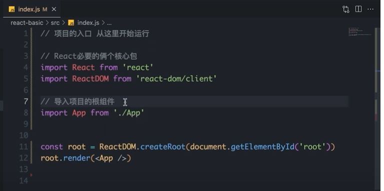
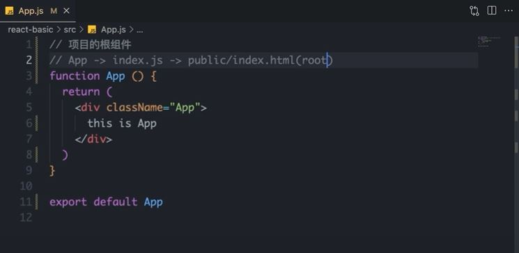
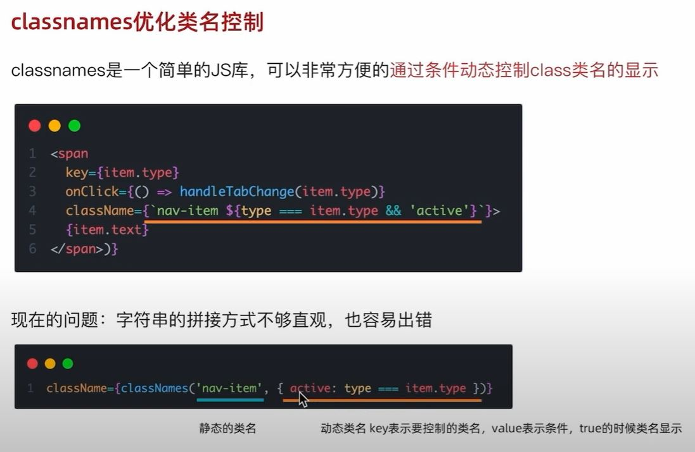
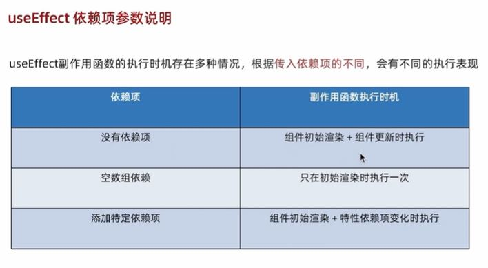
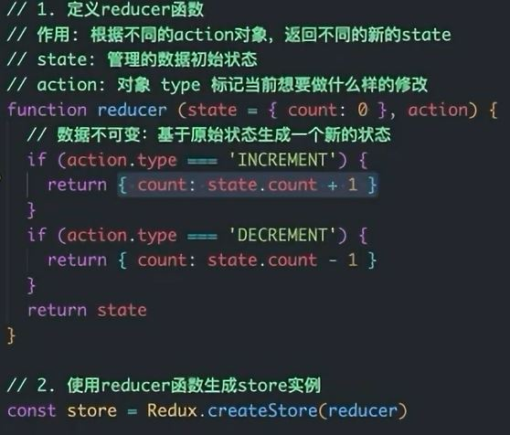
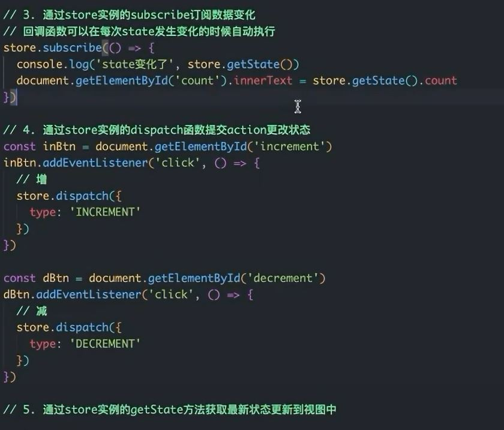
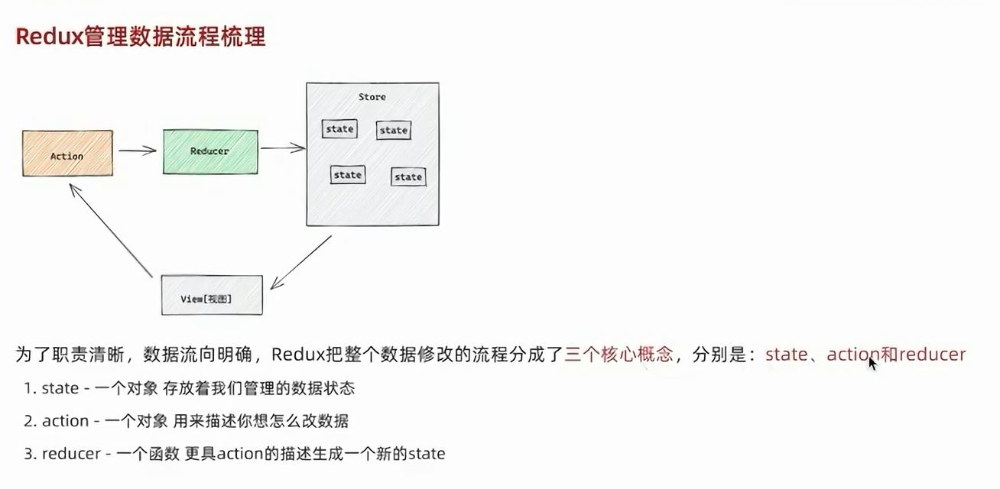
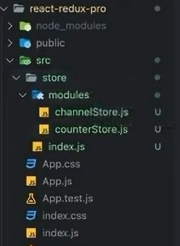

# React
## Introduction
构建Web和原生交互界面的库
  - 优势
    - 组件化开发
    - 有人说性能好，有人说性能不好
    - 丰富的生态
    - 跨平台
## 搭建工程化开发环境
`npx creat-react-app app-name`  
`cd app-name`  
`npm start`


package.json文件:  
核心包：`react`, `react-dom`  
`script`:`start`, `build`  

src文件夹：  
只保留 index.js, app.js


- 将app跟组件渲染到id为root的dom节点上


## JSX - JavaScript XML 的 概念 和 本质
### JavaScript XML
代表在JS中编写HTML模板结构，既享受了HTML声明式的模板写法，又享受JS的可编程能力
```jsx
const message = 'this is message'
function App () {
  return (
  <div> {/* HTML声明式模板 */}
    <h1>this is title</h1> {/* HTML声明式模板 */}
    {message} {/* js语法，读取变量的值 */}
  </div>
  );
}

```
### 历史
JSX 而是Facebook开发的JavaScript库，用于构建用户界面（UI）。JSX旨在简化React组件的声明，主要目标是提供一种声明性的方式来描述用户界面的结构，使得代码更易读、更易理解。
### 识别 和 转译
JSX不是标准的JS语法，是JS的语法扩展，为了让浏览器能识别，需要在webpack中`npm run build`的时候利用babel做解析
> 我们可以通过编译器网站 babeljs.io 来 try it out
### JSX 使用的高频场景
#### JSX中的JS表达式 ：将JS写在{}里
  1. "字符串" 
    - `{'This is a string'}`
  2. 变量 
    - `{varName}`
  3. 函数调用和方法调用 
    - `{fun()}`
    - `{new Date().getDate()}`
  4. 使用JS对象 
    - `{obj}`
    - `<div style={{color: 'blue'}}>this is div</div>`
  > 注意：只有表达式可以识别，语句是不可以的，比如if语句，switch语句，变量声明语句，是不能写在{}里的，表达式就是不执行某个动作的情况下返回一个值，而语句是执行某个动作但不返回值,但也有例外。
  
#### JSX中的列表渲染  
使用js原生的map方法
```jsx
<ul>
  {list.map((item) => {<li key={item.id}>{item.name}</li>})}
</ul>
{/* 使用map时，循环哪个结构就return哪个结构 */}
{/* key是react内部用的标识，用于提升渲染速度 */}
```
#### 条件渲染  
- 逻辑与运算符 &&  
  - 控制一个元素
  - `{flag && <span>This is span</span>}`
- 三元表达式 ?:
  - 控制两个元素
  - `{isLogin ? <span>loading...</span> ： <span>This is span</span>}`
- 实现复杂条件渲染
  - 解决方案：自定义函数 + if 语句或其他条件判断，在jsx中调用渲染
  - 多个三元表达式，这样可以吗？是不是可读？
#### React事件绑定
- on + 事件名称 = {事件处理程序}
- 在做模板，遍历，删除，编辑的时候非常常见
- 分为三种情况
```jsx
{/* 不传参数，只获取事件参数e */}
const hanleClick = (e) => {
  console.log('button被点击了', e)
}

{/*...*/}

<button onClick={handleClick}>click me</button>
```
如何传递自定义参数：
```jsx
{/* 不要事件参数，只想获取自定义参数 */}
const hanleClick = (name, e{/* 注意参数顺序 */}) => {
  console.log('button被点击了', name)
}

{/*...*/}

<button onClick={() => handleClick('Jack')}>click me</button>
{/* 即想要自定义参数，又想获取事件参数e */}
<button onClick={(e) => handleClick('Jack')}>click me</button> 
```

###  React中的组件
什么是组件
  - 组件是一个通用的概念，是不挑框架的
  - 组件又自己的逻辑和外观，组件可以互相嵌套和复用
  - 就像搭积木一样
  - 一个首字母大写的函数，内部存放了组建的逻辑和视图UI，渲染组件只需要把组件当成标签书写即可
  ```jsx
  // 自定义组件
  function Button() { // 也可以写箭头函数
    // 组件内部逻辑
    return <button>click me</button>
  }

  // 使用(渲染)组件
  function App(){
    return (
      <div>
      // 自闭和
      <button />
      // 成对标签
      <button></button> 
      </div>
    )
  }
  ```
### useState
useState 是一个函数，允许我们向组件添加一个状态变量
```jsx
const [count, setCount] = useState(0)
```
```jsx
//点击加一的按钮
import {usState} from React;
function App() {
const [count, setCount] = useState(0); // useState()返回的是一个数组，所以使用解构赋值法
  handleClick = () => {
  setCount(count + 1)
  }
  return (
    <div>
    <button onClick={handleClick}>{count}</button>
    </div>
  )
}
```
#### 状态不可变规则
- 改变状态不能使用再次赋值
- 而是使用setState方法，这样才能渲染页面

#### 修改对象状态
规则：对于对象类型的状态变量，应该始终传给set方法一个全新的对象来进行修改
```jsx
import {useState} from react;
function App() {
  const [form, setForm] = useState({name: 'jack'})

  const changeForm = () => {
    setForm({
      ...form, // 展开字符串
      name: 'Peter'
    })
  }

  return(
    <div>
      <button onClick = {changeForm}>修改form{form.name}</button>
    </div>
  )
}

// 拓展：数组和对象是一样的
```
### React中的样式
样式插入
  - 行内样式（不推荐）
  - class类名控制
```jsx
// 行内样式 1
function App() {

  return (
    <div> {/* style 是一个对象格式 */}
      <span style={{color: 'blue', fontSize:'50px'}}>span</span>
    </div>
  )
}

expert default App;

// 行内样式 2

function App() {

  {/* style 是一个对象格式 */}
  style = {
    color: 'blue', 
    fontSize:'50px'
    }

  return (
    <div>
      <span style={style}>span</span>
    </div>
  )
}

expert default App;
```
class类名控制：
```jsx
import './index.css'

function App() {

  return(
    <div>
      <span className="foo">span</span>
    </div>
  )
}
```
```css
 .foo {
  color: blue;
  fontSize: 50px;
 }

```
### B站案例
重点：
1. 可以使用useState方法更改数组
    ```jsx
    const [commentList, setCommentList] = useState(arr)
    ```
2. 用map渲染li，不要忘了key
3. 条件渲染，比如只有自己的评论才显示删除按钮
4. 删除功能的逻辑是通用的，即拿到id，并以id为条件对评论列表进行处理
5. 事件传参记得使用箭头函数
### 渲染tab和点击高亮（通用的渲染事件）
- 渲染tab：使用map方法，可以使用type或其他属性名作为独一无二的标识，为`:active`/点击高亮做准备
- 点击高亮: 实现思路：使用map添加点击事件，点击处理函数useState更改类名状态，map循环条件匹配类名实现渲染，设置类名样式来处理
  1. 在map遍历时为每一项绑定点击事件
  1. 点击谁就把谁的type记录下来，将type名作为参数传递给事件处理函数，
  2. 使用useState，在事件处理函数里setState(type)
  3. 在map遍历中将设置的被点击的type和每一项遍历时的type做匹配，如果相同就添加active类名
  4. 在css中设置active类名的样式。
### 排序功能（开发理念：数据驱动视图，数据一变，UI也变，比如filter功能）
- 核心思路：把评论列表状态数据进行不同的排序处理，只要状态一变，生成一份重新排列好的新新数据（原不可变）并传给set函数，所以视图也会变

- 数据排序方法：使用**lodash**工具
**lodash**是一个封装好的函数库，包含很多好用的方法，不用自己写方法。

### classnames 是一个 JS 库，可以非常方便的通过条件动态控制class类名的显示


### 受控表单绑定
- react state 和 input 的 value 互相绑定，互相影响。
- 可以保证数据来源更可靠。

```jsx
const [value, setValue] = useState('')

<input 
  type='text' 
  value={value} 
  onChange={(e)=>{e.target.value}} />
```

### 在react中获取DOM, 不建议（因为数据驱动视图原则），但有时也需要用
- 需要使用钩子useRef
  1. 使用useRed创建ref对象，并与DOM绑定
  ```jsx
  const inputRef = useRef(null)
  
  <input type='text' ref={inputRef}>
  ```
  2. 在 DOM 可用时，使用`ref.current`获取dom
    - 获取的dom元素并不是立刻就可用的，需要在渲染完毕之后也就是dom生成之后才可用
### 使用uuid生成唯一的随机id
`import {v4 as uuidv4} from 'uuid'`
`object.id = uuidv4()`
### day.js可以生成格式化的当前时间 
`dayjs().format()`
### 实用技术补充
1. 表单提交后清空输入框：
  - 使用setState将受控input框设置为''
2. 提交后重新聚焦表单
  - 获取dom元素(使用useRef)并使用focus
  - `const inputRef = useRef(null)`
  - 在<input />中添加`ref={inputRef}`属性
  - `inpurRef.current.focus()`

### 组件通信
组件之间根据不同的关系有不同的方法
- 父传子：使用 props
  - 父组件传递数据：在子组件元素标签中绑定属性，比如 属性={数据} 或 属性={数据的属性名}，数据类型不限，甚至可以是jsx模板
  - 子组件接受数据：数据在形参props中
    - props是一个对象，里面包含了父组件传递过来的所有数据。访问数据使用dot notation
  - props 是只读的，谁的数据谁负责修改，父组件的数据只有父组件能修改
    ```jsx
    // 父组件
    const app = () => {
      const name = 'This is App name.'
      return(
        <div>
          <Son 
            name={name}          
            age={18}          
            isTrue={false}          
            list={['vue', 'react']}   
            obj={{name:'jack', age: 18}}  
            cb={() => console.log(123)}  
            child={<span>This is a span</span>}   
          />
        </div>
      )
    }
    
    //子组件
    const Son = (props) => {
      return(
        <div>This is son, {props.name}, jsx: {props.child}
      
        </div>
      )
    }
    ```
  - 特殊的props: 当把内容放在组件标签中时，也相当于向子组件传递数据children的props里，比如
    ```jsx
    <Son>
      <span>This is a span</span> //会被当作props
    </Son>

    //在Son组件中
    {props.children}
    ```
- 子传父
  - 在子组件里调用父组件的函数并传递参数就可以了
  - 在父组件往子组件元素标签传递函数的时候使用 on + functionName 命名规范
- 使用状态提升实现兄弟组件通信
  - 先传给父组件，再传给兄弟组件
- 跨层组件通信
  - context
    - 使用createContext()方法来创建上下文对象
    - 再顶层组件（提供数据的组件）中使用Ctx.provider组件提供数据
    - 在底层组件中，使用useContext钩子来获取数据

### useEffect
- 不是有事件引起而是由渲染本身引起的操作
  - 比如只要渲染完毕，就 fetch data 获取数据
  - 两个参数，副作用函数 和 依赖项（可选的）


### 关于 useEffect 清除副作用
- 最常见的执行时机是在组件卸载时自动执行
  - 比如 卸载一个开启的定时器
  ```jsx
  useEffect(()=>{
    const timer = setInterval(()=>{
      console.log('timer')
    }, 1000)

    return()=>{
      clearInterval(timer)
    }
  }, [])
  ```
  - 在这段代码中，return语句用于清除副作用。具体来说，当组件卸载或useEffect中的依赖项发生变化时，React 将执行清除函数。在这里，清除函数通过调用clearInterval(timer)来取消定时器，确保在组件卸载或依赖项变化时清理资源，以避免内存泄漏或其他不必要的副作用。

### 自定义hook
  封装自定义hook
- toggle
```jsx
function App(){
  const [value, setValue] = useState(true)

  const toggle = () => {
    setValue(!value)
  }

  return(
    <div>
      {value && <div>this is div</div>} {/*条件渲染，判断是否渲染toggle*/}
      <button onClick={toggle}>toggle</button>
    </div>
  )
}
```

- 以上代码实现了toggle，但是不能复用，为了实现复用，可以写一个自定义组件
  - 实现思路：
    - 写一个以use打头的函数
    - 封装 useState 和 setState 逻辑代码
    - return 出去需要在其他函数中使用的状态和状态设置回调函数
    - 在那个组件中要用到这个逻辑，就执行这个函数，解构出来状态和设置状态的回调函数
  - code
    ```jsx
    function toggle(){
      {value, setValue} = useState(true)
      const toggle = () => {
        setValue(!value)
      }
      return {
        value, 
        toggle
        }
    }

    function App (){
      const { value, toggle } = useToggle()
      return(
        { value && <div>this is div<div>}
        ...html
      )
    }
    ```

### React Hooks 使用规则
1. 只能在组件中或自定义函数中使用，而不是组件或自定义函数外使用
2. 不能在if语句, for循环，或内部函数中使用，只能在顶层使用

> 开发过程中可以使用 json-server 工具来模拟后端api  
> axios 是一个 promise 的请求库，可以用于 浏览器 和 node.js  
> axios请求一般写在一个 函数内部，然后执行此函数。也就是将 axios 请求封装在一个函数内部，并运行此函数去发送请求。  

### 优化需求-自定义hook函数封装数据请求
- 模块化和可维护性
- 可重用性
- 更清晰的组件
- 测试性
- 适应 Hooks API

### 智能组件（获取数据） 和 UI组件（渲染视图）分离
- 将渲染过程封装一个UI组件，然后将此组件插入视图中

## Redux 学习

- React中最常见的状态集中管理工具，可以独立与框架
- use store as independent state manager
- 使用步骤
  - 定义一个reducer函数(根据当前想要做的修改返回一个新的状态)
  - 使用createStore方法传入一个reducer函数，生成一个store实例对象
  - 使用store实例的subscribe方法订阅数据的变化（数据一旦变化，可以得到通知）
  - 使用store实力的dispatch方法提交action对象出发数据变化（告诉reducer你想怎么改数据）（在redux中修改数据的唯一方式就是使用dispatch方法提交action对象）
  - 使用store实例的getState方法获取罪行的状态数据更新到视图中
### 独立使用Redux




### Redux 在 React 环境中的使用
- 官方推荐的两个工具
  - Redux Toolit
  - react-redux
- 目录设计


[next](https://www.youtube.com/watch?v=RJW9I1yZ1JY&list=PLFbd8KZNbe-_cp9SRCpEBnBzZoBYl4fIR&index=40)

